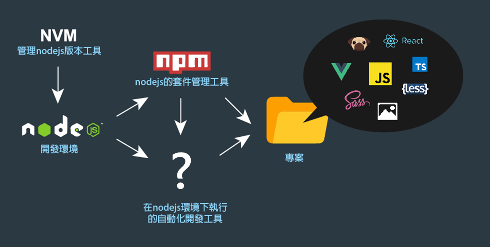
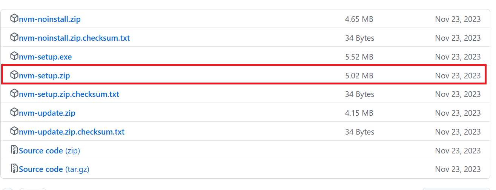

# 目錄

- [第一章 複雜資料進階篇](#第一章-複雜資料進階篇)
  - [物件](#物件)
  - [陣列](#陣列)
  - [資料格式的基本觀念](#資料格式的基本觀念)
  - [function 回傳](#function-回傳)
  - [操作資料](#操作資料)
  - [陣列進階篇](#陣列進階篇)
    - [forEach](#forEach)
    - [filter](#filter)
    - [every](#every)
    - [map](#map)
- [第二章 進階字串處理](#第二章-進階字串處理)
  - [去除空白 trim()](#去除空白)
  - [分割字串 slice()](#分割字串)
  - [變化英文字母大小寫 toLocaleLowerCase(),toLocaleUpperCase() ](#變化英文字母大小寫)
  - [字串反轉 split(),reverse().join()](#字串反轉)
  - [字串取代 replace()](#字串取代)
  - [取得字串位置 indexOf()](#取得字串位置)
  - [數字千分位符號](#數字千分位符號)
- [第三章 非同步處理](#第三章-非同步處理)
  - [介紹 api](#課程-api)
  - [非同步介紹](#非同步介紹)
  - [get 與 post](#get-與-post)
  - [非同步工具 axios](#非同步工具axios)
  - [Json 與 FormData](#Json-與-FormData)
  - [非同步資料動態渲染列表實作](#非同步資料動態渲染列表實作)
  - [常見的 HTTP 狀態碼](#常見的-HTTP-狀態碼)
  - [跨網域存取 CROS](#跨網域存取-CROS)
- [第四章 共載組件載入篇](#第四章-共載組件載入篇)
  - [非同步載入共用組件](#非同步載入共用組件)
  - [程式流程控管](#程式流程控管)
- [第五章 網址篇](#第五章-網址篇)
  - [網址轉址與重整](#網址轉址與重整)
  - [開新視窗](#開新視窗)
  - [網址 GET 參數](#網址GET參數)
  - [轉址帶參數注意事項](#轉址帶參數注意事項)
- [第六章 正規表達式入門 Regular Expression](#第六章-正規表達式入門)
  - [匹配](#匹配)
  - [模糊匹配](#模糊匹配)
  - [檢查是否輸入大寫英文](#檢查是否輸入大寫英文)
  - [修飾符](#修飾符)
  - [頭尾](#頭尾)
  - [方括號與大括號](#方括號與大括號)
  - [使用網路上現有的正規式表達法](#使用網路上現有的正規式表達法)
- [第七章 ES6 升級指南](#第七章-ES6升級指南)
  - [let 與 const](#let-與-const)
  - [解構賦值](#解構賦值)
  - [展開運算子](#展開運算子)
    - [array][#array]
    - [object][#object]
  - [字串模板](#字串模板)
  - [箭頭涵式](#箭頭涵式)
  - [target 與 currentTarget](#target-與-currentTarget)
- [第八章 javaScript 模組化入門](#第八章-javaScript模組化入門)
- [第九章 javaScript 矯正姿勢篇](#第九章-javaScript矯正姿勢篇)

---

# 第一章 複雜資料進階篇

### 物件

> 網頁中任何元素都是物件，那怕是一個 p 標籤都是物件

```js
var obj1 = {};
console.log(obj1);
```

> object 寫法是大括弧

```js
var obj2 = {
  name: 'mike',
  age: 18,
  sex: 'male',
};

console.log(obj2);
console.log(obj2.name);
console.log(obj2.age);
console.log(obj2.sex);

obj.age = 12;
console.log(obj2.age);
```

> object 的讀取和存取可以直接賦值

```html
<body>
  <a id="alink" href="javascript:;" target="_blank">超連結標籤</a>
  <script>
    var dom = document.getElementById('alink');
    console.log(dom.id);
    console.log(dom.href);
    console.log(dom.target);
  </script>
</body>
```

**Object vs Array**

```js
var obj = {
  name: 'mike',
  age: 18,
  sex: 'male',
};
console.log(obj.name);

var arr = ['mike', 18, 'male'];
console.log(arr[0]);
```

### Object vs Array

| 項目             | Object                             | Array                         |
| ---------------- | ---------------------------------- | ----------------------------- |
| **資料結構**     | 無序的鍵值對 (Key-Value Pair)      | 有序的元素列表 (Indexed List) |
| **鍵的型別**     | 任意型別的鍵 (Key 必須是唯一的)    | 鍵為數字索引 (從 0 開始)      |
| **資料存取方式** | 使用鍵 (key) 存取資料              | 使用索引 (index) 存取資料     |
| **適用場景**     | 儲存結構化或命名資料，例如物件屬性 | 儲存列表、順序相關的資料      |
| **常見方法**     | `Object.keys()`、`Object.values()` | `push()`、`pop()`、`map()`    |
| **初始化語法**   | `{ key1: value1, key2: value2 }`   | `[value1, value2, value3]`    |
| **資料順序**     | 不保證順序                         | 保持插入順序                  |
| **操作效率**     | 適合需要快速查找鍵值的操作         | 適合需要依序操作資料的情境    |
| **重點特性**     | 各鍵對應的值可能是不同型別         | 所有元素通常屬於相同類型      |

**object 常用的使用方式**

```js
var obj = {
  name: 'mike',
};

console.log(obj.name);
console.log(obj['name']);

obj.sex = 'female';
console.log(obj.sex);
console.log(obj['sex']);
```

> 使用時機，需要動態的替換

```js
var obj = {
  name: 'mike',
  age: 18,
};

var text = 'name';
console.log(obj[text]);
```

### 陣列包物件

```js
[
  {
    // ....
  },
  {
    // ....
  },
  {
    // ....
  },
];
```

> 多筆資料裡面又有屬性的時候就會使用陣列包物件

**範例:**

```js
var Staff = [
  {
    name: 'mike',
    sex: 'male',
    age: '18',
    salary: '22000',
  },
  {
    name: 'jacky',
    sex: 'male',
    age: '18',
    salary: '76000',
  },
  {
    name: 'andy',
    sex: 'male',
    age: '40',
    salary: '80000',
  },
  {
    name: 'scars',
    sex: 'male',
    age: '30',
    salary: '85000',
  },
  {
    name: 'ash',
    sex: 'female',
    age: '25',
    salary: '78000',
  },
];

console.log(Staff);
```

### 陣列迴圈應用

1. 範例一

**原本陣列寫法**

```js
var html = '';
var title = [
  '會計年度最後一個月 美國防部狂花1.4億買蝦蟹...',
  '大逆轉！情侶照1.5萬變16萬 當事人道歉了...',
  '台南是民主聖地？謝龍介：變民主很火大...',
  '槓王選立委！韓笑回他長大了 潘恆旭尷尬回應...',
  '捷運西門站藥妝搶駐！日藥妝210萬標下6店面...',
  '她全身麻醉動刀 苦求男友陪！遭嗆：我要上班...',
  '自閉症青年音樂家亞洲巡迴 精彩演出獲好評...',
  '小黃司機遭3人挾持30公里！傳LINE求救逃脫...',
];
var url = [
  'https://news.ebc.net.tw/News/Article/155505',
  'https://news.ebc.net.tw/News/Article/155504',
  'https://news.ebc.net.tw/News/Article/155503',
  'https://news.ebc.net.tw/News/Article/155502',
  'https://news.ebc.net.tw/News/Article/155501',
  'https://news.ebc.net.tw/News/Article/155500',
  'https://news.ebc.net.tw/News/Article/155499',
  'https://news.ebc.net.tw/News/Article/155497',
];

for (var i = 0; i < title.length; i++) {
  html +=
    '<li><a href="' + url[i] + '" target="_blank">' + title[i] + '</a></li>';
}
document.getElementById('list').innerHTML = html;
```

** 轉換成 object 寫法**

```js
var html = '';
var news = [
  {
    title: '會計年度最後一個月 美國防部狂花1.4億買蝦蟹...',
    url: 'https://news.ebc.net.tw/News/Article/155505',
  },
  {
    title: '大逆轉！情侶照1.5萬變16萬 當事人道歉了...',
    url: 'https://news.ebc.net.tw/News/Article/155504',
  },
  {
    title: '台南是民主聖地？謝龍介：變民主很火大...',
    url: 'https://news.ebc.net.tw/News/Article/155503',
  },
  {
    title: '槓王選立委！韓笑回他長大了 潘恆旭尷尬回應...',
    url: 'https://news.ebc.net.tw/News/Article/155502',
  },
  {
    title: '捷運西門站藥妝搶駐！日藥妝210萬標下6店面...',
    url: 'https://news.ebc.net.tw/News/Article/155501',
  },
  {
    title: '她全身麻醉動刀 苦求男友陪！遭嗆：我要上班...',
    url: 'https://news.ebc.net.tw/News/Article/155499',
  },
  {
    title: '小黃司機遭3人挾持30公里！傳LINE求救逃脫...',
    url: 'https://news.ebc.net.tw/News/Article/155497',
  },
];

for (var i = 0; i < news.length; i++) {
  html +=
    '<li><a href="' +
    news[i].url +
    '" target="_blank">' +
    news[i].title +
    '</a></li>';
}

document.getElementById('list').innerHTML = html;
```

### 物件包陣列

**範例:做一個搜尋引擎出來**

> 步驟 1: 先做完點擊 Trending searches:時可以跑出相關列表

> 步驟 2: 再做打 input 後可以拿到搜尋列表

**因應你的需求也會有這種物件裡面是陣列的複合式使用方式，key 支援中文，不過要用 "" 給包起來，這種做法也是很常見!**

```html
<body>
  <div class="mid">
    <input class="search" type="text" value="Online Courses" />
    <p>
      Trending searches: <a class="tag" href="javascript:;">Matsu</a>、
      <a class="tag" href="javascript:;">Earthquake</a>、
      <a class="tag" href="javascript:;">Curator</a>、
      <a class="tag" href="javascript:;">Online Courses</a>
    </p>
    <div class="search_list">
      <!-- <div class="item">
                  <a href="javascript:;" target="_blank" class="title">Matsu Belief in Taiwan - Wikipedia, the Free Encyclopedia</a>
                  <a href="javascript:;" target="_blank" class="link">https://zh.wikipedia.org/zh-tw/台灣媽祖信仰</a>
                  <p>媽The belief in Matsu is a common folk belief in Taiwan. Early immigrants came from South China, crossing the seas with trepidation. Matsu, the sea goddess, became an important spiritual symbol for the Taiwanese people...</p>
              </div> -->
    </div>
  </div>
  <script>
    var searchData = {
      Matsu: [
        {
          title: 'Matsu Belief in Taiwan - Wikipedia, the Free Encyclopedia',
          link: 'https://zh.wikipedia.org/zh-tw/台灣媽祖信仰',
          text: 'The belief in Matsu is a common folk belief in Taiwan. Early immigrants came from South China, crossing the seas with trepidation. Matsu, the sea goddess, became an important spiritual symbol for the Taiwanese people...',
        },
        {
          title: 'Introduction to Matsu',
          link: 'www.ntcu.edu.tw/edison/otm/__1.html',
          text: "Matsu, also known as the 'Heavenly Mother,' is a widely respected deity in Taiwan. Her real name was Lin Mo-Niang, known for her intelligence and strong memory of scriptures...",
        },
      ],
      Earthquake: [
        {
          title: 'Earthquake - Central Weather Bureau',
          link: 'https://www.cwb.gov.tw/V7/earthquake/',
          text: 'Data Source: Earthquake auto-location information released by the US Geological Survey. This webpage only shows global earthquakes with a magnitude of 6 or above...',
        },
      ],
      Curator: [
        {
          title: 'Curator Genghis Khan - YouTube',
          link: 'https://www.youtube.com/channel/UCnnp2fWa77PP2h08T7WAzzw',
          text: 'The paradise of fitness and martial arts enthusiasts. Genghis Khan Fitness Club and Evolution MMA Center...',
        },
        {
          title: 'Chen Zhihan - Wikipedia, the Free Encyclopedia',
          link: 'https://zh.wikipedia.org/zh-tw/陳之漢',
          text: "Chen Zhihan (born March 12, 1979), also known as 'Curator,' is a Taiwanese internet celebrity, entrepreneur, fitness coach, and founder of a fitness chain...",
        },
      ],
      'Online Courses': [
        {
          title: 'Modern JavaScript Path｜Beginner Edition',
          link: 'https://hiskio.com/courses/244',
          text: 'Learn the fundamentals of JavaScript with hands-on practice and practical examples. This course is designed to help you become a professional front-end developer!',
        },
        {
          title: 'Modern JavaScript Path｜Intermediate Edition',
          link: 'https://hiskio.com/courses/245',
          text: 'Advance your skills with expert mentorship and real-world projects to become a proficient front-end engineer.',
        },
        {
          title: 'Responsive Web Design Essentials',
          link: 'https://hahow.in/cr/responsive-design',
          text: 'Master the principles of responsive design with practical examples, addressing common challenges like layout issues on mobile devices...',
        },
      ],
    };

    var searchObj = searchData['Online Courses'];
    var search = document.getElementsByClassName('search')[0];
    var searchList = document.getElementsByClassName('search_list')[0];
    var tags = document.getElementsByClassName('tag');
    var html = '';

    // DOM rendering
    function DOMrender() {
      html = '';
      searchList.innerHTML = '';
      for (var i = 0; i < searchObj.length; i++) {
        html += '<div class="item">';
        html +=
          '<a href="javascript:;" target="_blank" class="title">' +
          searchObj[i].title +
          '</a>';
        html +=
          '<a href="' +
          searchObj[i].link +
          '" target="_blank" class="link">' +
          searchObj[i].link +
          '</a>';
        html += '<p>' + searchObj[i].text + '</p>';
        html += '</div>';
      }
      searchList.innerHTML = html;
    }

    // Click event for tags
    for (var s = 0; s < tags.length; s++) {
      tags[s].addEventListener('click', searchTagChange);
    }

    // Update data when a tag is clicked
    function searchTagChange() {
      searchObj = searchData[this.innerText];
      search.value = this.innerText;
      DOMrender();
    }

    // Keyup event for the input field
    console.log(search);
    search.addEventListener('keyup', function () {
      searchObj = searchData[this.value];
      if (searchObj === undefined) {
        searchObj = [];
      }
      DOMrender();
    });

    // Initialize
    DOMrender();
  </script>
</body>
```

### 資料格式的基本觀念

```js
var arr = [1, 2, 3, 4, 5, 6, 7, 8, 9, 10];

var obj = {
  name: 'mike',
};

var arrArr = [
  ['2019/01/01', 'https://www.cwb.gov.tw/V7/earthquake/'],
  ['2019/01/02', 'https://www.cwb.gov.tw/V7/earthquake/'],
];

var arrObj = [
  {
    date: '2019/01/01',
    url: 'https://www.cwb.gov.tw/V7/earthquake/',
  },
  {
    date: '2019/01/02',
    url: 'https://www.cwb.gov.tw/V7/earthquake/',
  },
  {
    date: '2019/01/03',
    url: 'https://www.cwb.gov.tw/V7/earthquake/',
  },
];

var nested = {
  idx: '1',
  date: '2019/01/01',
  userList: [
    { name: 'mike' },
    { name: 'jacky' },
    { name: 'andy' },
    { name: 'scars' },
    { name: 'ash' },
  ],
};
```

### function 回傳

**點擊 btn 拿資料**

> e 為滑鼠事件的東西，可以操作點擊後的所有東西

> this == e.Target

```js
document.getElementById('btn').addEventListener('click', function (e) {
  console.log(e);
});

function Test() {
  return 1 + 1;
}
console.log(Test());

function propsAdd(a, b) {
  return a + b;
}
console.log(propsAdd(1, 1));
```

> 當程式執行的時候就會返回停止，不會再繼續執行了

> return 要在涵式裡執行，不能在涵式外面執行

### 操作資料

#### 原本操作:既要操作資料又要操作頁面

#### 現在操作:只要操作資料，讓資料自己去操作頁面

> 讓資料和邏輯切開

**原先範例**

```js
var menu = document.getElementsByClassName('menu')[0];
var menuBtn = document.getElementsByClassName('menuBtn')[0];
var closeBtn = document.getElementsByClassName('closeBtn')[0];
menuBtn.addEventListener('click', function () {
  menu.classList.add('open');
});
closeBtn.addEventListener('click', function () {
  menu.classList.remove('open');
});
```

**用 Object​.define​Property()修改後的範例**

> Object​.define​Property() 可以監控 Object 的 api，Object 一有變化就會去執行

> Object​.define​Property(data,key,object)

**參數說明:**

1. data: 綁定的資料

2. key: 偵測哪個值變化時做改變

3. object: 物件設定(get[拿]，set[取])

   - 後面沒有賦予(assign)值就是 get
   - 賦予(assign)值就是 set

##### 範例一:

```js
var menu = document.getElementsByClassName('menu')[0];
var menuBtn = document.getElementsByClassName('menuBtn')[0];
var closeBtn = document.getElementsByClassName('closeBtn')[0];

var data = {
  isMenuOpen: false,
};

Object.defineProperty(data, 'isMenuOpen', {
  get: function () {
    return isMenuOpen;
  },
  set: function (value) {
    isMenuOpen = value;
    handClass();
  },
});

function handClass() {
  //後面沒有賦予(assign)值就是get
  if (data.isMenuOpen) {
    menu.classList.add('open');
  } else {
    menu.classList.remove('open');
  }
}

//====================================================================================

//賦予(assign)值就是set
menuBtn.addEventListener('click', function () {
  data.isMenuOpen = true;
});
closeBtn.addEventListener('click', function () {
  data.isMenuOpen = false;
});
```

##### 範例二:更改 05 的範例改為用 Object​.define​Property()

```html
<body>
  <div class="mid">
    <input class="search" type="text" value="Online Courses" />
    <p>
      Trending searches: <a class="tag" href="javascript:;">Matsu</a>、
      <a class="tag" href="javascript:;">Earthquake</a>、
      <a class="tag" href="javascript:;">Curator</a>、
      <a class="tag" href="javascript:;">Online Courses</a>
    </p>
    <div class="search_list">
      <!-- <div class="item">
                  <a href="javascript:;" target="_blank" class="title">Matsu Belief in Taiwan - Wikipedia, the Free Encyclopedia</a>
                  <a href="javascript:;" target="_blank" class="link">https://zh.wikipedia.org/zh-tw/台灣媽祖信仰</a>
                  <p>媽The belief in Matsu is a common folk belief in Taiwan. Early immigrants came from South China, crossing the seas with trepidation. Matsu, the sea goddess, became an important spiritual symbol for the Taiwanese people...</p>
              </div> -->
    </div>
  </div>
  <script>
    var searchData = {
      Matsu: [
        {
          title: 'Matsu Belief in Taiwan - Wikipedia, the Free Encyclopedia',
          link: 'https://zh.wikipedia.org/zh-tw/台灣媽祖信仰',
          text: 'The belief in Matsu is a common folk belief in Taiwan. Early immigrants came from South China, crossing the seas with trepidation. Matsu, the sea goddess, became an important spiritual symbol for the Taiwanese people...',
        },
        {
          title: 'Introduction to Matsu',
          link: 'www.ntcu.edu.tw/edison/otm/__1.html',
          text: "Matsu, also known as the 'Heavenly Mother,' is a widely respected deity in Taiwan. Her real name was Lin Mo-Niang, known for her intelligence and strong memory of scriptures...",
        },
      ],
      Earthquake: [
        {
          title: 'Earthquake - Central Weather Bureau',
          link: 'https://www.cwb.gov.tw/V7/earthquake/',
          text: 'Data Source: Earthquake auto-location information released by the US Geological Survey. This webpage only shows global earthquakes with a magnitude of 6 or above...',
        },
      ],
      Curator: [
        {
          title: 'Curator Genghis Khan - YouTube',
          link: 'https://www.youtube.com/channel/UCnnp2fWa77PP2h08T7WAzzw',
          text: 'The paradise of fitness and martial arts enthusiasts. Genghis Khan Fitness Club and Evolution MMA Center...',
        },
        {
          title: 'Chen Zhihan - Wikipedia, the Free Encyclopedia',
          link: 'https://zh.wikipedia.org/zh-tw/陳之漢',
          text: "Chen Zhihan (born March 12, 1979), also known as 'Curator,' is a Taiwanese internet celebrity, entrepreneur, fitness coach, and founder of a fitness chain...",
        },
      ],
      'Online Courses': [
        {
          title: 'Modern JavaScript Path｜Beginner Edition',
          link: 'https://hiskio.com/courses/244',
          text: 'Learn the fundamentals of JavaScript with hands-on practice and practical examples. This course is designed to help you become a professional front-end developer!',
        },
        {
          title: 'Modern JavaScript Path｜Intermediate Edition',
          link: 'https://hiskio.com/courses/245',
          text: 'Advance your skills with expert mentorship and real-world projects to become a proficient front-end engineer.',
        },
        {
          title: 'Responsive Web Design Essentials',
          link: 'https://hahow.in/cr/responsive-design',
          text: 'Master the principles of responsive design with practical examples, addressing common challenges like layout issues on mobile devices...',
        },
      ],
    };

    var search = document.getElementsByClassName('search')[0];
    var search_list = document.getElementsByClassName('search_list')[0];
    var tag = document.getElementsByClassName('tag');
    var html = '';

    var searchObj = {
      item: [],
    };

    Object.defineProperty(searchObj, 'item', {
      get: function () {
        return item;
      },
      set: function (value) {
        DOMrender(value);
      },
    });

    // DOM 元素的操作
    function DOMrender(value) {
      var step = value;
      if (value === undefined) {
        step = [];
      }
      html = '';
      search_list.innerHTML = '';
      for (var i = 0; i < step.length; i++) {
        html += '<div class="item">';
        html +=
          '<a href="javascript:;" target="_blank" class="title">' +
          step[i].title +
          '</a>';
        html +=
          '<a href="' +
          step[i].link +
          '" target="_blank" class="link">' +
          step[i].link +
          '</a>';
        html += '<p>' + step[i].text + '</p>';
        html += '</div>';
      }
      search_list.innerHTML = html;
    }

    //點擊標籤
    for (var s = 0; s < tag.length; s++) {
      tag[s].addEventListener('click', searchTagChange);
    }

    // 更改點到的資料
    function searchTagChange() {
      searchObj.item = searchData[this.innerText];
      search.value = this.innerText;
    }

    //鍵盤事件
    search.addEventListener('keyup', function () {
      searchObj.item = searchData[this.value];
    });

    // 初始化執行
    searchObj.item = searchData['Online Courses'];
  </script>
</body>
```

##### 範例三: 練習讓 Object​.define​Property()吃多個屬性

```html
<body>
  <button id="btn1">Change Title</button>
  <button id="btn2">Change Link</button>
  <button id="btn3">Cange Text</button>
  <button id="btn4">Cange Money</button>

  <script>
    var data = {
      title: 'Modern JavaScript Path｜Intermediate Edition',
      link: 'https://hiskio.com/courses/245',
      text: 'You need an instructor with years of industry experience and teaching expertise to guide you from basics to becoming a skilled front-end engineer.',
      money: '3800',
    };

    function BindValue(obj, key, callback) {
      var val = obj[key];
      Object.defineProperty(obj, key, {
        get: function () {
          return val;
        },
        set: function (value) {
          val = value;
          callback(val);
        },
      });
    }

    BindValue(data, 'title', handleTitle);
    BindValue(data, 'link', handleLink);
    BindValue(data, 'text', handleText);
    BindValue(data, 'money', handleMoney);

    function handleTitle(val) {
      console.log(data);
    }

    function handleLink(val) {
      console.log(data);
    }

    function handleText(val) {
      console.log(data);
    }

    function handleMoney(val) {
      console.log(data);
    }

    document.getElementById('btn1').addEventListener('click', function () {
      data.title = 'Responsive Web Design Essentials';
    });

    document.getElementById('btn2').addEventListener('click', function () {
      data.link = 'https://hahow.in/cr/responsive-design';
    });

    document.getElementById('btn3').addEventListener('click', function () {
      data.text =
        'Start from scratch and build a strong foundation with hands-on practice. Learn to solve common mobile layout issues and master responsive design techniques.';
    });

    document.getElementById('btn4').addEventListener('click', function () {
      data.money = '2000';
    });
  </script>
</body>
```

### 陣列進階篇

#### forEach

**forEach()  方法會將陣列內的每個元素，皆傳入並執行給定的函式一次。**

用法:

```js
array.forEach(function (currentValue, index, array) {
  // 你的邏輯
}, thisArg);
```

參數說明：

- currentValue: 正在處理的陣列元素。
- index（可選）: 正在處理的元素的索引。
- array（可選）: 正在操作的陣列本身。
- thisArg（可選）: 執行回呼函數時 this 的值。

**範例:**

> 引入資料

> 將 for 迴圈改寫成 forEach

> 試著用 forEach 寫出 filter 的效果

```html
<body>
  <div id="app">
    <ul class="tit_select">
      <li></li>
      <li>
        <select id="user_money">
          <option value="0">Select Money</option>
          <option value="300">Greater than 300</option>
          <option value="700">Greater than 700</option>
          <option value="10000">Greater than 10000</option>
        </select>
      </li>
      <li>
        <select id="user_age">
          <option value="0">Select Age</option>
          <option value="10">Older than 10</option>
          <option value="20">Older than 20</option>
          <option value="30">Older than 30</option>
        </select>
      </li>
      <li>
        <select id="user_sex">
          <option value="no">Select Gender</option>
          <option value="Male">Male</option>
          <option value="Female">Female</option>
        </select>
      </li>
    </ul>
    <ul class="tit">
      <li>Name</li>
      <li>Account Money</li>
      <li>Age</li>
      <li>Gender</li>
    </ul>
    <div class="itemList">
      <!-- <ul class="tit2">
                <li>John</li>
                <li>12000</li>
                <li>12</li>
                <li>Male</li>
            </ul> -->
    </div>
  </div>

  <script src="./js/data.js"></script>
  <script>
    var itemList = document.getElementsByClassName('itemList')[0];
    var user_money = document.getElementById('user_money');
    var user_age = document.getElementById('user_age');
    var user_sex = document.getElementById('user_sex');
    var html = '';
    var newData = data;

    // Render the UI
    function DOMReader(arr) {
      html = '';
      itemList.innerHTML = '';
      arr.forEach(function (obj) {
        html += '<ul class="tit2">';
        html += '<li>' + obj.name + '</li>';
        html += '<li>' + obj.money + '</li>';
        html += '<li>' + obj.age + '</li>';
        html += '<li>' + obj.sex + '</li>';
        html += '</ul>';
      });
      itemList.innerHTML = html;
    }

    // Handle money filter
    function userMoney(value) {
      var m = Number(value);
      var arr = [];
      newData.forEach(function (obj) {
        if (obj.money > m) {
          arr.push(obj);
        }
      });
      DOMReader(arr);
    }

    // Handle age filter
    function userAge(value) {
      var m = Number(value);
      var arr = [];
      newData.forEach(function (obj) {
        if (obj.age > m) {
          arr.push(obj);
        }
      });
      DOMReader(arr);
    }

    // Handle gender filter
    function userSex(value) {
      var arr = [];
      newData.forEach(function (obj) {
        if (obj.sex === value) {
          arr.push(obj);
        }
        if (value === 'no') {
          arr.push(obj);
        }
      });
      DOMReader(arr);
    }

    user_money.addEventListener('change', function () {
      userMoney(this.value);
    });
    user_age.addEventListener('change', function () {
      userAge(this.value);
    });
    user_sex.addEventListener('change', function () {
      userSex(this.value);
    });

    DOMReader(newData);
  </script>
</body>
```

**this 指向: 對於 function 被哪個監聽所調用去指向那個監聽，不能放在 forEach 裡面!!**

> 當 this 沒有指向被監聽的 function 時，會一律指向最外層的 window

#### filter

**filter() 方法會搜尋符合條件的資料然後返回再構成的新陣列。**

用法:

```js
array.filter(callback(element, index, array), thisArg);
```

參數說明:

- callback: 必需。用來測試每個陣列元素的函式。
  - element: 當前被處理的元素。
  - index: 可選，當前元素的索引。
  - array: 可選，調用 filter 的陣列本身。
- thisArg: 可選。執行回調函式時作為 this 的值。

**範例:**

```js
var itemList = document.getElementsByClassName('itemList')[0];
var user_money = document.getElementById('user_money');
var user_age = document.getElementById('user_age');
var user_sex = document.getElementById('user_sex');
var html = '';
var newData = data;

// Render the content
function DOMrender(arr) {
  html = '';
  itemList.innerHTML = '';
  arr.forEach(function (item) {
    html += '<ul class="tit2">';
    html += '<li>' + item.name + '</li>';
    html += '<li>' + item.money + '</li>';
    html += '<li>' + item.age + '</li>';
    html += '<li>' + item.sex + '</li>';
    html += '</ul>';
  });
  itemList.innerHTML = html;
}

// Handle money filter
function SeachDataMoney(value) {
  var num = Number(value);
  var arr = newData.filter(function (obj) {
    return obj.money > num;
  });
  DOMrender(arr);
}

// Handle age filter
function SeachDataAge(value) {
  var num = Number(value);
  var arr = newData.filter(function (obj) {
    return obj.age > num;
  });
  DOMrender(arr);
}

// Handle gender filter
function SeachDataSex(value) {
  var arr = newData.filter(function (obj) {
    if (value === 'no') {
      return obj;
    }
    return obj.sex === value;
  });
  DOMrender(arr);
}

user_money.addEventListener('change', function () {
  SeachDataMoney(this.value);
});
user_age.addEventListener('change', function () {
  SeachDataAge(this.value);
});
user_sex.addEventListener('change', function () {
  SeachDataSex(this.value);
});

DOMrender(newData);
```

#### every

**every() 方法會檢查所有的陣列是否符合條件，只會回傳一個值 true 或 false 。**

用法:

```js
array.every(callback(element, index, array), thisArg);
```

參數說明:

- callback: 必需。用來測試每個陣列元素的函式。
  - element: 當前被處理的元素。
  - index: 可選，當前元素的索引。
  - array: 可選，調用 every 的陣列本身。
- thisArg: 可選。執行回調函式時作為 this 的值。

**範例:檢查 checkbox 的每一個是否有勾選**

```js
var submit = document.getElementById('submit');

function checkFn() {
  var checkboxArr = [
    document.getElementById('query1'),
    document.getElementById('query2'),
    document.getElementById('query3'),
  ];
  var ans = checkboxArr.every(function (item) {
    return item.checked === true;
  });
  return ans;
}

function changeFn() {
  var isChecked = checkFn();
  submit.disabled = !isChecked;

  // if(isChecked){
  //     submit.disabled = false;
  // }else{
  //     submit.disabled = true;
  // }
}

document.getElementById('query1').addEventListener('change', changeFn);
document.getElementById('query2').addEventListener('change', changeFn);
document.getElementById('query3').addEventListener('change', changeFn);
changeFn();

submit.addEventListener('click', function () {
  alert('Success');
});
```

#### map

**map() 方法會透過函式內所回傳的值而組合成一個新陣列 。**

用法:

```js
array.map(callback(element, index, array), thisArg);
```

參數說明:

- callback: 必需。用來測試每個陣列元素的函式。
  - element: 當前被處理的元素。
  - index: 可選，當前元素的索引。
  - array: 可選，調用 map 的陣列本身。
- thisArg: 可選。執行回調函式時作為 this 的值。

**範例:重組 array**

```js
var arr = [
  {
    name: 'Max',
    sex: 'Male',
  },
  {
    name: 'Alice',
    sex: 'FeMale',
  },
  {
    name: 'Chris',
    sex: 'Male',
  },
  {
    name: 'Martain',
    sex: 'Male',
  },
  {
    name: 'Bob',
    sex: 'Male',
  },
];

// ["MaxMale", "AliceFemale", "ChrisMale", "MartainMale", "BobMale"]

var forArr = arr.map(function (obj) {
  return obj.name + obj.sex;
});

var html = '';
forArr.forEach(function (obj) {
  html += '<li>' + obj + '</li>';
});

var itemBox = document.getElementById('itemBox');
itemBox.innerHTML = html;
```

#### `forEach` 和 `map` 的差異

| 特徵                 | `forEach`                                                      | `map`                                              |
| -------------------- | -------------------------------------------------------------- | -------------------------------------------------- |
| **用途**             | 用於遍歷陣列並執行副作用（例如：輸出到 console、更新變數等）。 | 用於遍歷陣列並返回一個包含修改後元素的新陣列。     |
| **返回值**           | 返回 `undefined`。                                             | 返回一個包含修改後元素的新陣列。                   |
| **變更原陣列**       | 可以改變原陣列。                                               | 不會改變原陣列。                                   |
| **是否可以鏈式調用** | 不可鏈式調用（因為返回 `undefined`）。                         | 可鏈式調用（返回新陣列，可以繼續鏈式調用）。       |
| **回調函數參數**     | 提供當前元素、索引和值本身。                                   | 提供當前元素、索引和值本身。                       |
| **適用情境**         | 當你只需要遍歷陣列並執行動作，而不需要返回結果時使用。         | 當你需要對每個陣列元素進行轉換並創建新陣列時使用。 |
| **副作用**           | 常用於執行副作用，例如輸出或更新變數。                         | 不常用於副作用，主要用於創建新的陣列。             |

---

# 第二章 進階字串處理

## 去除空白

** trim 可以將頭尾的空格去除，常用再表單欄位幫助使用者防呆!**

```html
<body>
  <div>
    <input id="searchBar" type="text" />
    <button id="submit">送出</button>
  </div>

  <script>
    var searchBar = document.getElementById('searchBar');
    var submit = document.getElementById('submit');

    submit.addEventListener('click', function () {
      var str1 = searchBar.value;
      var str2 = searchBar.value.trim();

      console.log('str1:', str1);
      console.log('str2:', str2);
    });
  </script>
</body>
```

## 分割字串

**slice() 方法可以用來分割字串或陣列，並返回其中的一部分。這個方法並不會改變原來的字串或陣列，而是返回一個新的字串或陣列。**

```js
str.slice(beginIndex, endIndex);
```

- beginIndex：指定開始切割的位置（包含此位置）。
- endIndex（可選）：指定切割的結束位置（不包含此位置）。如果省略此參數，則切割會一直到字串的結尾。

```js
var email = '1208966@gmail.com';

// 取索引3 ~ 7之間的字串
console.log(email.slice(3, 7));

// 取索引7之後的所有字串
console.log(email.slice(7));

// 取索引 0 ~ "@" 的索引位置的字串
// indexOf 取得查找比對相對應的索引位置，如果沒有回傳 -1
console.log(email.slice(0, email.indexOf('@')));
```

## 變化英文字母大小寫

- toLocaleLowerCase() 大寫轉小寫
- toLocaleUpperCase() 小寫轉大寫

> **當使用這 function 時，前面字串不能是 null 或 undefine!!不然會報錯**

**範例一:請把輸入的英文字母都轉成小寫，並且欄位不可以沒有值**

```js
var searchBar = document.getElementById('searchBar');
var submit = document.getElementById('submit');

submit.addEventListener('click', function () {
  var value = searchBar.value.trim();
  var tlc = value.toLocaleLowerCase();
  if (tlc === '') {
    alert('欄位不可以空白');
    return;
  }
  console.log(tlc);
});
```

## 字串反轉

> split() => 分割字串

```js
str.split(separator, limit);
```

- separator：用來分割字串的分隔符，可以是字串或正規表達式。如果不指定，split() 會將整個字串作為一個元素返回。
- limit（可選）：限制返回的陣列元素的數量。

```js
var text = reverse('HelloMike!');
console.log(txt.split('')); //切割出每個字變成array

var str = 'apple,banana,cherry';

// 以逗號分割字串
var result = str.split(',');
console.log(result); // 輸出: ["apple", "banana", "cherry"]
```

> reverse() => 反轉 array 裡面的每個物品

```js
let numbers = [1, 2, 3, 4, 5];

// 反轉陣列
let reversedNumbers = numbers.reverse();

console.log(reversedNumbers); // 輸出: [5, 4, 3, 2, 1]
console.log(numbers); // 輸出: [5, 4, 3, 2, 1]，原始陣列也被修改了
```

> join() => 反轉 array 裡面的每個物品

```js
arr.join([separator]);
```

- arr：要操作的陣列。
- separator（可選）：用來分隔陣列元素的字串。如果不指定，默認使用逗號 ,。如果指定空字串 ""，則陣列元素會被緊密地連接在一起。

** 範例:**

```js
function reverse(txt) {
  return txt.split('').reverse().join('');
}

var text = reverse('HelloMike!');

console.log(text);
```

## 字串取代

> repace()

```js
str.replace(searchValue, newValue);
```

- searchValue：這是要查找的子字串，這個可以是字串或者是正則表達式。如果是字串，replace() 只會替換第一個匹配的子字串；如果是正則表達式，則可以根據正則的設定進行多次替換。
- newValue：這是用來替換 searchValue 的字串。可以是普通字串，或者是包含參數的函數（詳見下面的範例）。
- 原本字串並不會改變

**範例:把 2019-01-01 換成 2019/01/01**

```js
var date = '2019-01-01';
console.log(date.replace('-', '/'));
console.log(date.replace(/-/g, '/')); //正規表達式:g代表全部=>後面會教
```

[第六章 正規表達式入門](#第六章-正規表達式入門)

## 取得字串位置

> indexOf() 是 JavaScript 中的一個字串方法，用來查找指定字串或字符在目標字串中的首次出現位置。如果找到，返回該字符或子字串的索引（位置）；如果未找到，則返回 -1。

```js
str.indexOf(searchValue, start);
```

- searchValue：這是你要查找的字串或字符。
- start（可選）：從指定的索引位置開始查找。默認為 0，即從字串的起始位置開始查找。

**範例:**

```js
var arr = ['mike', 'jacky', 'andy', 'ash', 'scars'];
var str = '123@456789';

console.log(arr.indexOf('andy'));
console.log(str.indexOf('@'));
```

## 數字千分位符號

**範例:讓數字在千分","**

> 5241522 ->5,241,522

步驟:

1. 把數字變成字串

2. 切字串變成陣列

3. 用 forEach()每三個位置加','

4. 把字串組和回去

```js
function Num(num) {
  var n = num + '';
  var numArr = n.split('').reverse();
  var overArr = [];
  var i = 0;
  numArr.forEach(function (item) {
    i++;
    if (i > 3) {
      i = 1;
      overArr.push(',');
    }
    overArr.push(item);
  });
  overArr.reverse();
  return overArr.join('');
}

var n = Num(5241522);
console.log(n);
```

---

# 第三章 非同步處理

## 介紹 api

> 前端跟後端溝通的一種手段

[講解影片](#https://youtu.be/zvKadd9Cflc)

## 非同步介紹

> 若 js 由上而下執行，則為同步，若不是由上而下執行則為不同不

**範例:**

```js
console.log('1');
console.log('2');
console.log('3');
console.log('4');
setTimeout(function () {
  console.log('5');
}, 2000);
console.log('6');
console.log('7');
console.log('8');
console.log('9');
```

## get 與 post

**get:此方法會把資料帶到網址後面，以問號的形式帶入** => 不安全的行為(不是適合傳送)

**post:需要有另一方去接收資料，若沒有會報錯**

1. 資料不會秀在網址上面給別人看到

2. 要看到資料要去 Network 面板，勾選 Preserve log 往上找就能看到，點頁面，點 header，下滑就看得見

## 非同步工具 axios

**下載指令:**

```shell
npm install axios
```

**CDN 載入**

```html
<script src="https://cdnjs.cloudflare.com/ajax/libs/axios/0.18.0/axios.js"></script>
```

**範例:**測試看看 axios 是否同步

```js
console.log('1');

axios
  .get('./api/data.json')
  .then(function (res) {
    //沒有錯誤時會執行
    console.log('get:', res);
    console.log('2');
  })
  .catch(function (error) {
    //有錯誤時會執行
    console.error(error);
  });

console.log('3');
```

## Json 與 FormData

**Json:**

- JavaScript Object Notation (JSON) 為將結構化資料呈現為 JavaScript 物件的標準格式，常用於網站上的資料呈現。

- JSON 是依照 JavaScript 物件語法的資料格式，雖然 JSON 是以 JavaScript 語法為基礎，但可獨立使用，且許多程式設計環境亦可讀取 (剖析) 並產生 JSON。

- JSON 可能是物件或字串。當你想從 JSON 中讀取資料時，JSON 可作為物件；當要跨網路傳送 JSON 時，就會是字串。這不是什麼大問題 — JavaScript 提供全域 JSON 物件，其內的函式可進行切換。

- JSON 物件可儲存於其自有的檔案中，基本上就是副檔名為 .json 的文字檔案。

```json
[
  {
    "idx": 1,
    "name": "Jack",
    "money": 12000,
    "age": 12,
    "sex": "Male"
  },
  {
    "idx": 2,
    "name": "Amy",
    "money": 52000,
    "age": 20,
    "sex": "Female"
  },
  {
    "idx": 3,
    "name": "John",
    "money": 150,
    "age": 16,
    "sex": "Male"
  },
  {
    "idx": 4,
    "name": "Alex",
    "money": 360000,
    "age": 35,
    "sex": "Male"
  },
  {
    "idx": 5,
    "name": "Tom",
    "money": 650,
    "age": 19,
    "sex": "Male"
  },
  {
    "idx": 6,
    "name": "Jane",
    "money": 9999,
    "age": 40,
    "sex": "Female"
  },
  {
    "idx": 7,
    "name": "Emma",
    "money": 10,
    "age": 2,
    "sex": "Female"
  },
  {
    "idx": 8,
    "name": "Ben",
    "money": 500,
    "age": 30,
    "sex": "Male"
  }
]
```

```js
var obj = {
  idx: 1,
  name: 'Jack',
  money: 12000,
  age: 12,
  sex: 'Male',
};
```

**FormData:**

```js
var obj = new FormData();
obj.append('idx', 1);
obj.append('name', 'Jack');
obj.append('money', 12000);
obj.append('age', 12);
obj.append('sex', 'Male');
```

**傳送給後端**

```js
axios;.post('url',obj)
.then(function(res){
  console.log(res)
})
.catch(function(error){
  console.error(error)
})
```

> 分辨辦法，去看 F12，Network 頁面的 header 裡的 multipart 是什麼類型

## 非同步資料動態渲染列表實作

> 用 api 撈回資料的方式，把資料放在下拉式選單

```js
window.onload = function () {
  var city = []; //儲存城市
  var area = []; //儲存鄉鎮
  var html = ''; //城市下拉
  var areahtml = ''; //鄉鎮下拉

  //拉取鄉鎮資料
  axios
    .get('./api/twzip.json')
    .then(axiosCallBack)
    .catch(function (error) {
      console.log(error);
    });
  //拉取資料完成
  function axiosCallBack(res) {
    city = res.data.twzip.city;
    renderCity(city);
    SelectChange();
  }
  //產生城市下拉列表
  function renderCity(city) {
    city.forEach(function (item) {
      html += '<option value="' + item.name + '">' + item.name + '</option>';
    });
    document.getElementById('city').innerHTML = html;
    areaChange();
  }
  //執行抓取新的鄉鎮列表
  function areaChange() {
    var cit = document.getElementById('city').value;
    var area = city.filter(function (item) {
      return item.name === cit;
    });
    renderArea(area[0].area);
  }

  //產生鄉鎮下拉列表
  function renderArea(arr) {
    areahtml = '';
    arr.forEach(function (item) {
      areahtml +=
        '<option value="' + item.name + '">' + item.name + '</option>';
    });
    document.getElementById('area').innerHTML = areahtml;
  }

  //監聽程式下拉列表 change 事件
  function SelectChange() {
    document.getElementById('city').addEventListener('change', function () {
      areaChange();
    });
  }
};
```

## 常見的 HTTP 狀態碼(restful API)

[HTTP 狀態碼查詢](https://zh.wikipedia.org/wiki/HTTP%E7%8A%B6%E6%80%81%E7%A0%81)

- 2xx 成功
  - http 請求成功
- 4xx 用戶端錯誤
  - http 請求失敗，常見的可能是
    - 404 找不到資源，或是 403 請求不符合規範
- 5xx 伺服器錯誤
  - 這類狀態碼 90% 代表了伺服器在處理請求的過程中有錯誤或者異常狀態發生，你就可以先去找後端，不是你的 code 寫錯！

### 業界常見

> 不會直接判斷外層的 status，而是會判斷 Body 裡面的

```json
{
  "message": "Accept Request",
  "status": 200,
  "value": {
    "name": "Jack",
    "age": 20
  }
}

{
  "message": "Reject Request",
  "status": 401,
  "value": {
   "The Account not exist!!"
  }
}
```

> 這時候前端要改成

```js
axios
  .get('URL')
  .then(function (res) {
    if (res.data.status != '200') {
      alert(res.data.message);
    } else {
      //處理成功的邏輯
    }
  })
  .catch(function (error) {
    console.error(error);
  });
```

## 跨網域存取 CROS

```js
var url = 'https://www.vscinemas.com.tw/VsWeb/api/GetLstDicCinema';

axios
  .get(url)
  .then(function (res) {
    console.log('拿到資料:', res.data);
  })
  .catch(function (error) {
    alert(error.response.data.msg);
    console.error('發生錯誤 狀態碼不是200:', error.response.data.msg);
  });
```

> 需要在相同網域才能存取資料

---

# 第四章 共載組件載入篇

## 非同步載入共用組件

**利用 axios 載入其他的 html**

```js
window.onload = function () {
  var headerDOM = document.getElementById('header');
  var footerDOM = document.getElementById('footer');

  function getHeader() {
    return axios.get('./components/header.html');
  }
  function getFooter() {
    return axios.get('./components/footer.html');
  }

  axios.all([getHeader(), getFooter()]).then(
    axios.spread(function (header, footer) {
      headerDOM.innerHTML = header.data;
      footerDOM.innerHTML = footer.data;
    })
  );
};
```

## 程式流程控管

**當我們想控制哪個非同步先完成時，可以用:**

```js
axios.all([getApi1(), getApi2()]).then(
  axios.spread(function (api1, api2) {
    console.log(api1, api2);
  })
);
```

功能描述

> axios.all：接收一個包含多個 Promise 的陣列，並等待所有 Promise 完成。<br>
> axios.spread：用於展開 axios.all 傳回的結果，方便對每個回應進行單獨處理。<br>

---

# 第五章 網址篇

## 網址轉址與重整

**reload Page:**

```js
window.location.reload();
```

**Go to another page or url**

```js
window.location.href = 'url';
```

**Go to another page or url but didn't have back page**

```js
window.location.replace = 'url';
```

```html
<body>
  <button id="btn">點擊</button>
  <script>
    document.getElementById('btn').addEventListener('click', function () {
      // 本地重整
      window.location.reload();

      // 轉址
      window.location.href = 'open.html';

      // 轉址 (但是不會有上一頁)
      window.location.replace('open.html');
    });
  </script>
</body>
```

## 開新視窗

**reload Page:**

```js
window.open('url', '_blank', 'height=400, width=400');
```

=> 可以開啟新視窗，指定長寬

```js
document.getElementById('btn').addEventListener('click', function () {
  window.open('https://www.google.com.tw/', '_blank', 'height=400, width=400');
});
```

## 網址 GET 參數

```js
new Url();
```

=> 把網址後面的參數轉成物件

```js
// ?name=mike&age=12
var search = new Url(window.location.search);
console.log(search.query);
```

## 轉址帶參數注意事項

**若要帶參數一起過去新的網址**

```js
// ?name=mike&age=12
console.log(window.location.search);
document.getElementById('btn').addEventListener('click', function () {
  window.location.href = 'search.html' + window.location.search;
});
```

**要知道是哪個網址來的**

```js
var search = new Url(window.location.search);
conosle.log(search.query.from);
```

---

# 第六章 正規表達式入門

**(Regular Expression):正規表示式是電腦科學的一個概念，使用單個字串來描述、符合一系列符合某個句法規則的字串。**

[線上測試工具](https://regexper.com/)
[正規範例](#字串取代)

=> 正規表達法寫法，頭尾都要有/，/之間裝的是比對的值

```js
/-/; //只會找第一個是'-'，之後就不會再找
/-/g; //g是全部的意思
```

```
\^(([^<>()[\]\\.,;:\s@\"]+(\.[^<>()[\]\\.,;:\s@\"]+)*)|(\".+\"))@((\[[0-9]{1,3}\.[0-9]{1,3}\.[0-9]{1,3}\.[0-9]{1,3}\])|(([a-zA-Z\-0-9]+\.)+[a-zA-Z]{2,}))$\
```

## 匹配

**用正規式找出有'ECMAScript'的字樣後取代成'@JS@'**

```js
var regex = /ECMAScript/g;
var str =
  'ECMAScript is a scripting-language specification standardized by Ecma International in ECMA-262 and ISO/IEC 16262. It was created to standardize JavaScript, so as to foster multiple independent implementations. JavaScript has remained the best-known implementation of ECMAScript since the standard was first published, with other well-known implementations including JScript and ActionScript.ECMAScript is commonly used for client-side scripting on the World Wide Web, and it is increasingly being used for writing server applications and services using Node.js.';
var txt = str.replace(regex, '@JS@');

document.getElementById('app').innerHTML = '<h3>' + txt + '</h3>';
```

## 模糊匹配

**如果頭尾一樣中間不一樣時就可以用模糊匹配**

```js
/E([a-zA-Z]+)t/g;
```

- `()`: 表示式匹配到的內容可以被單獨得到
- `[]`: 用於查找範圍內的字串
- `a-zA-Z`: 所有的英文字母包括大小寫
- `+`:匹配前一字元多次
- g: 全部的內容比對

```js
var regex = /E([a-zA-Z]+)t/g;

var str =
  'ECMAScript Javscript EggCat E123456789t Eabcdefg ecmascripT Ecmascript';
var txt = str.match(regex);

var html = '';
txt.forEach(function (item) {
  html += '<li>' + item + '</li>';
});
document.getElementById('app').innerHTML = html;
```

[線上預覽工具](https://regex101.com/)

## 檢查是否輸入大寫英文

**檢查的正規式 fun 要使用:**

```js
var regex = /[A-Z]/g;
const value = 'MIKE';
const res = regex.test(value);
```

> regex: 放正規式的規則
> .test: 則是看是否比對符合，若符合會回傳 true，反之為 false
> value: 放要比對的值

```html
<body>
  <div>
    <h1>請輸入你的英文名字</h1>
    <input id="searchBar" type="text" placeholder="輸入大寫的英文字母" />
    <button id="submit">送出</button>
  </div>

  <script>
    var searchBar = document.getElementById('searchBar');
    var submit = document.getElementById('submit');
    var regex = /[A-Z]/g;

    submit.addEventListener('click', function () {
      var value = searchBar.value.trim();
      if (value === '') {
        alert('欄位不可以空白');
        return;
      }

      if (regex.test(value) === false) {
        alert('請輸入大寫英文字母');
        return;
      }

      alert('輸入成功');
    });
  </script>
</body>
```

## 修飾符

**想把大小寫也模糊比對**

```js
/ECMAScript/gi;
```

> 在 g(global)後面增加 i(insensitive)，就可以把大小寫給模糊掉

**範例:**

```js
var regex = /ECMAScript/gi;
var str =
  'ECMAScript Javscript EggCat E123456789t Eabcdefg ecmascripT Ecmascript';
var txt = str.match(regex);

var html = '';
txt.forEach(function (item) {
  html += '<li>' + item + '</li>';
});
document.getElementById('app').innerHTML = html;
```

## 頭尾

**若只想指定開頭，可以使用:`^`**

```js
/^air/;
```

**若只想指定結尾，可以使用:`$`**

```js
/air$/;
```

**若想指定開頭和結尾，中間任何元素都不管，可以使用:`.*`**

```js
/^a.*e$/;
```

> `.`: 代表特殊字符

> `*`: 代表全部

> `.*`: 只全部的字符，不管是`%#@&.`都會被比對出來

**因為在正規表達裡`.`代表特殊字符，所以如果要變成字串使用需在前面加`\`**

```js
/^.*@gmail\.com$/;
```

> `.`才會當成字串去比對

**範例 1:**

1. 比對開頭是 air

2. 比對尾巴是 er

3. 比對開頭是 air，尾巴是 er

```js
var strArr = [
  'airline',
  'banner',
  'apple',
  'cat',
  'dog',
  'applepay',
  'linerair',
  'airplane',
  'wayair',
  'habit',
];
var regexStart = /^air/;
var strfilter = strArr.filter(function (item) {
  return regexStart.test(item);
});
console.log('Start:', strfilter);

var regexEnd = /er$/;
var endfilter = strArr.filter(function (item) {
  return regexEnd.test(item);
});
console.log('End:', endfilter);

var regexMid = /^a.*e$/;
var midfilter = strArr.filter(function (item) {
  return regexMid.test(item);
});
console.log('Mid:', midfilter);
```

**範例 2:請找出為 gmail 的帳號**

```js
var mail = [
  'a123@gmail.com',
  'tesst@hotmail.com',
  'n789@gmail.com',
  'abcdef@yahoo.com',
  '55555@gmail.com',
  '1245@hotmail.com',
  'abc123@hotmail.com',
];
var regex = /^.*@gmail\.com$/;
var gmail = mail.filter(function (item) {
  return item.match(regex);
});

console.log(gmail);
```

## 方括號與大括號

**前面數字指定四個，可以用{4}來表示**

```js
/^([0-9]{4})/;
```

> 因為`/`為政則表達的結尾和開頭，若要單純判斷`/`的字串，需在前面加一個`\`

**範例: **

1. 找出符合正規日期的字串
2. 把符合正規日期的字串的`/`換成`-`
3. 並且嵌入到 ul 裡面

```js
var Datestr = [
  '2006/02/03',
  'test/07/sd',
  '2016/05/10',
  '1998/03/07',
  '12345/23/45678',
  '1234/23/45678',
  '12345/23/45',
];

var regex = /^([0-9]{4})\/([0-9]{2})\/([0-9]{2})$/;

var html = '';
var date = Datestr.filter(function (date) {
  return date.match(regex);
})
  .map(function (item) {
    return item.replace(/\//g, '-');
  })
  .forEach(function (obj) {
    html += '<li>' + obj + '</li>';
  });

document.getElementById('app').innerHTML = html;

console.log(date);
```

## 使用網路上現有的正規式表達法

```js
RegExp.test(str);
```

> 字串是否符合正則表達式規則，如果符合回傳 true 沒符合 false

```js
RegExp.exec(str);
```

> 字串是否符合正則表達式規則，如果符合回傳匹配結果，沒符合回傳 null

```js
String.replace(reg, str);
```

> 替換與正則表達式匹配的子串

```js
String.match(reg);
```

> 在字串方法內使用正則表達式來找到一個或是多個匹配的結果

```js
String.split(reg);
```

> 我們經常使用 split("")把字串分割成陣列，複雜的分割也可以使用正則表達式來解決

```js
String.search(reg);
```

> 在字串方法內使用正則表達式來匹配字串，不符合回傳-1，符合回傳第一個索引，不支援 g，不支援全局使用

**一般常見用法:**

```js
/^[a-zA-Z0-9]*$/;
```

> 檢查字串只能有文字與數字

```js
/^[a-zA-Z]*$/;
```

> 檢查字串只能有文字

```js
/^[0-9]*$/;
```

> 檢查字串只能有數字

```js
/^((0?[1-9]|1[012])[- /.](0?[1-9]|[12][0-9]|3[01])[- /.](19|20)?[0-9]{2})*$/;
```

> 檢查日期型態 (MM/DD/YYYY)

```js
/^((19|20)?[0-9]{2}[- /.](0?[1-9]|1[012])[- /.](0?[1-9]|[12][0-9]|3[01]))*$/;
```

> 檢查日期型態 (YYYY/MM/DD)

```js
/^([a-zA-Z0-9._%-]+@[a-zA-Z0-9.-]+\.[a-zA-Z]{2,4})*$/;
```

> Email 檢查

```js
/^((?:(?:25[0-5]|2[0-4][0-9]|[01]?[0-9][0-9]?)\.){3}(?:25[0-5]|2[0-4][0-9]|[01]?[0-9][0-9]?))*$/;
```

> 檢查 IP 位址

```js
/^(?=^.{8,}$)((?=.*[A-Za-z0-9])(?=.*[A-Z])(?=.*[a-z]))^.*$/;
```

> 檢查密碼：密碼長度必須有八碼，並且包含至少一個小寫字母與一個大寫字母和一個數字

```js
/^(((http|https|ftp):\/\/)?([[a-zA-Z0-9]\-\.])+(\.)([[a-zA-Z0-9]]){2,4}([[a-zA-Z0-9]\/+=%&_\.~?\-]*))*$/;
```

> 檢查網址

# 第七章 ES6 升級指南

## let 與 const

> let 的作用域範圍是再大括號內 { }

> const 則是常數，是不可以再被修改的變數

```js
//  let
console.log(a);
if (true) {
  var a;
}

console.log(b);
if (true) {
  let b;
}
// -------------------------

// const
const str = 'MIKE';
str = 'ANDY';
```

> 非同步環境下用 for 迴圈取得變數的值，只能用 let 不能用 var

```js
for (var i = 0; i < 5; i++) {
  setTimeOut(function () {
    console.log(i);
  }, 1000);
}
```

> console.log 出來的值只有`5`

```js
for (let i = 0; i < 5; i++) {
  setTimeOut(function () {
    console.log(i);
  }, 1000);
}
```

> console.log 出來的值才是`1,2,3,4,5`

## 解構賦值

```js
let data = {
  name: 'mike',
  age: 12,
  time: '2019/04/01',
};

var name = data.name;
var age = data.age;
var time = data.time;

// --------------------------------------------

function dataSet(obj) {
  let { name, age, time } = obj;
  return {
    name = name + '123',
    age,
    title,
  };
}

let objs = dataSet(data);

console.log(objs)

// -----------------------------------------------

const { name, age, time } = data;

function Test(name, age, title) {
  return {
    name,
    age,
    title,
  };
}

console.log(Test('jacky', 30, 'manager'));
```

## 展開運算子

### array

**把兩個 array 合併成一個 array**

1. 使用 concat()合併

```js
let arr3 = arr1.concat(arr2);
```

2. 使用展開運算子合併

```js
let arr3 = [...arr1, ...arr2];
```

**範例:**

```js
let arr1 = [1, 2, 3, 4];
let arr2 = ['a', 'b', 'c', 'd'];

// let arr3 = arr1.concat(arr2);
let arr3 = [...arr1, ...arr2];

console.log(arr3);
```

### object

**把兩個 array 合併成一個 array**

1. 使用 assign()合併

```js
let obj3 = Object.assign(obj1, obj2);
```

2. 使用展開運算子合併

```js
let obj3 = { ...obj1, ...obj2 };
```

**範例:**

```js
let obj1 = {
  name: 'mike',
};
let obj2 = {
  age: 12,
  title: '前端工程師',
};

// let obj3 = Object.assign(obj1, obj2);
let obj3 = { ...obj1, ...obj2 };

console.log(obj3);
```

## 字串模板

**範例(ES5):**

```js
const name = 'mike';
const mail = '1208966@gmail.com';

(document.getElementById('title').innerHTML = '姓名' + name +', 信箱' + mail;

var html = '';
html += '<ul>';
html += '<li>' + name + '</li>';
html += '<li>' + mail + '</li>';
html += '<ul>';
document.getElementById('title').innerHTML = html;

//ES6;

```

**範例(ES6):**

```js
const name = 'mike';
const mail = '1208966@gmail.com';

document.getElementById('title').innerHTML = `姓名:${name}, 信箱:${mail}`;
const html = `
    <ul>
        <li>${name}</li>
        <li>${mail}</li>
    </ul>
`;
document.getElementById('title').innerHTML = html;
```

## 箭頭涵式

**原本的 function 寫法**

```js
document.getElementById('btn').addEventListener('click', function (e) {
  console.log(this);
  console.log(e.target);
});
```

**箭頭涵式 寫法**

```js
document.getElementById('btn').addEventListener('click', (e) => {
  console.log(this); //沒有this這東西，若使用=>涵式則會指到window
  console.log(e.target);
});
```

**範例:用箭頭涵式使用 filter，找尋 sex 是 Male 的資料**

```js
//原先寫法

const res = data.filter(function (item) {
  return item.sex === 'Male';
});

//箭頭涵式寫法

const res = data.filter((item) => item.sex === 'Male');
console.log(res);
```

**一般涵式寫法**

```js
// ES5
function Add(a, b) {
  return a + b;
}
console.log(Add()); // NaN
console.log(Add(2, 3)); // 5

// ES6
const Add2 = (a = 1, b = 2) => {
  return a + b;
};
console.log(Add2()); // 3
console.log(Add2(5, 3)); // 8
```

**只要是箭頭涵式 this 就不會指向外層會直接指向 window**

## target 與 currentTarget

> target => 事件的觸發者

> currentTarget => 事件的真正監聽者。

```html
<body>
   <div class="link">
      <p>milk</p>
      <p>andy</p>
      <p>jack</p>
    <div>
  <script>
    document.getElementById('link').addEventListener('click', (e) => {
      console.log(e.target);
      console.log(e.currentTarget);
    });
  </script>
</body>
```

> 如果今天滑鼠放到文字上面點擊，那這時候的 target 的 log 會顯示點擊到的物件是 `<p>mike</p>`

> 而 currentTarget 的 log 會顯示 `<div class="link"><div>`，這就是 target 跟 currentTarget 的差異，所以在選擇上面可以依照情境來選擇，課程中因為是使用 button，所以我們用 target 是沒甚麼問題的，如果是點擊內容比較複雜的元件，那同學可以考慮用 currentTarget 來抓取事件真正的監聽對象。

> 額外補充一個小知識，其原因是因為我們的滑鼠放在 DOM 上面操作會穿透，所以它會觸發 click 事件，事件打穿到裡面的 p 標籤，所以我們可以使用 pointer-events: none; 來禁止該物件可以被觸發，就可以避免這問題

```css
.link > p {
  pointer-events: none;
}
```

# 第八章 javaScript 模組化入門



Step1: 下載 nodesjs(LTS 版本)

[下載網址](https://nodejs.org/zh-tw)

Step2: 安裝 NVM

[安裝網址](https://github.com/coreybutler/nvm-windows/releases)



Step3: 檢查是否有安裝完成

```shell
nvm -v
```

**有關 nvm 的指令**

```shell
nvm list
```

查看有哪些 Node 版本可以裝

```shell
nvm list available
```

安裝指定的 Node 版本

```shell
nvm install v22.11.0
```

指定 Node 版本

```shell
nvm use v22.11.0
```

# 第九章 javaScript 矯正姿勢篇

> 用更合理的方式寫 JavaScript

[Airbnb  英文版](https://github.com/airbnb/javascript)

[Airbnb  中文版](https://github.com/sivan/javascript-style-guide/blob/master/es5/README.md)

## 如何簡單去規劃程式架構

1. 將重複的邏輯拆開
2. 盡量將變數變成私有變數，除了全域會用的的以外
3. 保持進入點，確保程式流程正確
4. 不要真的沒事物件導向程式，先把 function 結構拆開比較重要
5. 不要寫多個主程式在頁面載入，會導致流程錯誤
